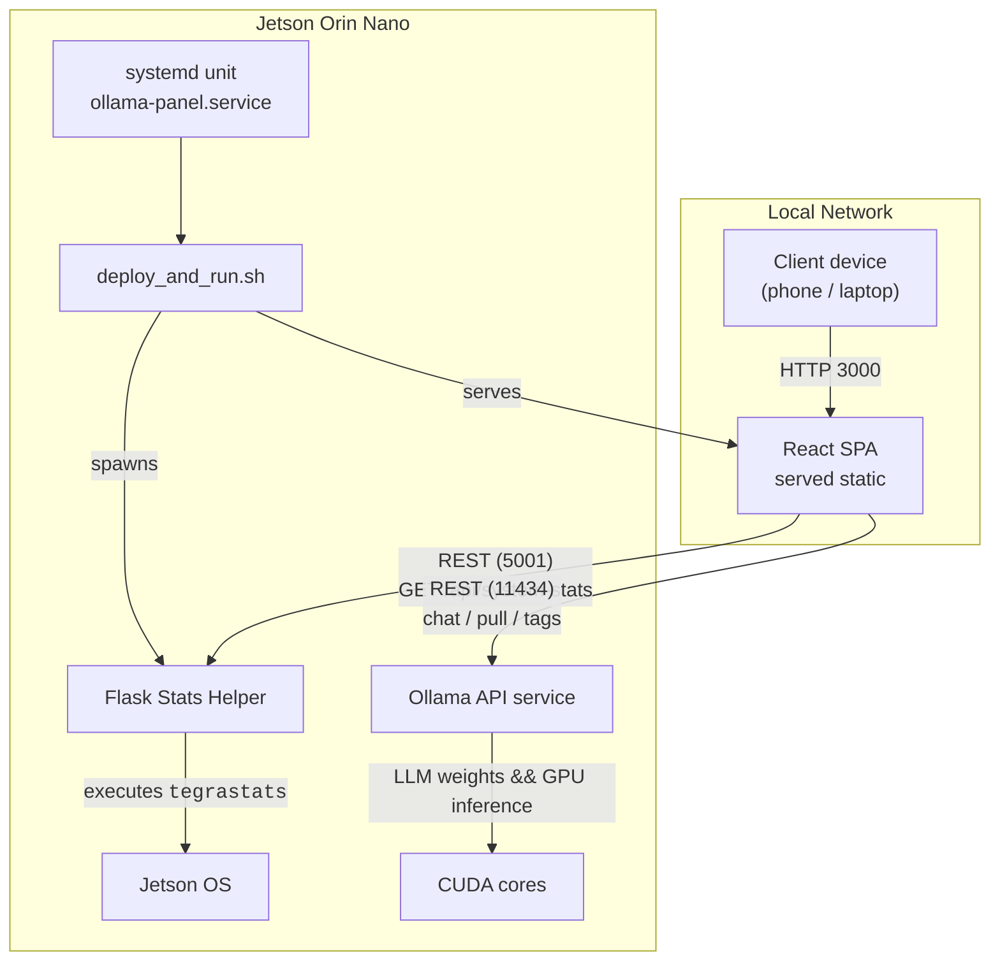

# Under the Hood: Mapping the Control-Panel Architecture

Having reached a stable first release of my Jetson Ollama Control Panel I wanted a clear, single-page view of how all the moving parts talk to one another. The flow-chart below is the result of that exercise and should give anyone skimming the repository an immediate mental model of the project.

## Reading the diagram

1. A browser anywhere on my LAN fetches the static build (port 3000). Once loaded the SPA runs entirely client-side.
2. For telemetry the UI polls the Flask *Stats Helper* (port 5001) every half-second. The helper shells out to `tegrastats`, parses the line and returns tidy JSON.
3. All model management and chat traffic goes straight from the UI to the **Ollama** daemon on port 11434. That keeps the control-surface thin; the Jetson does the heavy lifting.
4. Both servers are launched by `deploy_and_run.sh`, itself started by a `systemd` service. One unit therefore revives the whole stack on boot or crash.

## Component outline

• **React SPA** – compiled once, served with `serve`, and then entirely static. No Node server runs in production. 
• **Flask Stats Helper** – fewer than 150 lines and isolated from the chat path, so any fault here cannot stall conversations. 
• **Ollama Service** – untouched from upstream apart from a small drop-in that binds it to `0.0.0.0` and enables CORS. 
• **Deployment script & unit file** – fetch latest git, install dependencies, build the frontend and start both services under `nohup`.

## Reflections

Keeping the UI's requests symmetrical – one port for telemetry, one for language tasks – made life simpler than funnel-ling everything through a monolithic backend. The decision to spawn the Flask helper as a separate process paid off: it can be restarted independently and shields the browser from `tegrastats` quirks. Meanwhile the `systemd` unit means the whole panel survives reboots without manual intervention.

The end result is a lean three-service architecture that feels at home on the Orin Nano's limited RAM yet still lets anyone on the network tap into local LLM horsepower. 