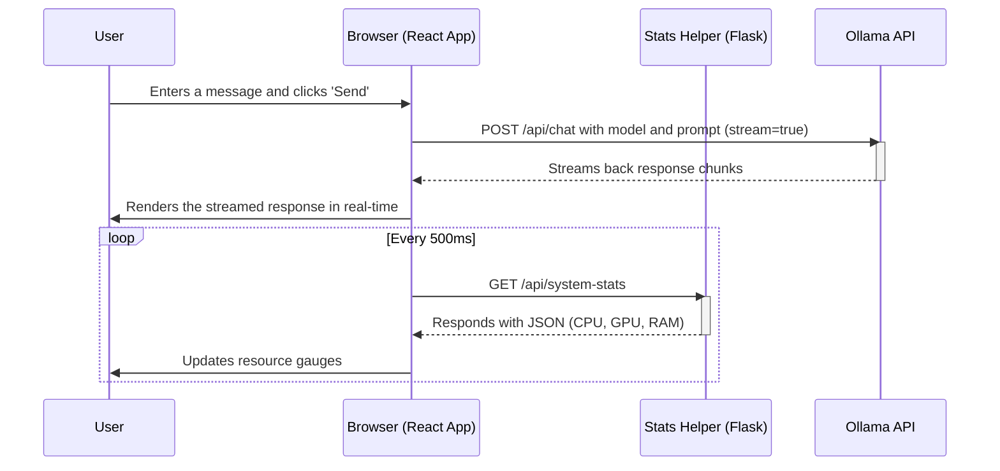

# Powering Local AI: A Deep Dive into the Jetson Ollama Control Panel

I've always been fascinated by the potential of running powerful AI models on compact, efficient hardware. The NVIDIA Jetson Orin Nano, with its impressive performance-per-watt, felt like the perfect candidate for experimenting with local large language models (LLMs). This project, the Jetson Ollama Control Panel, is the result of that exploration—a tool I built to streamline the process of managing and interacting with Ollama models on my own local network. This article reflects on its architecture, the challenges I faced, and the key lessons learned along the way.

---

## The Core Idea: A Mission Control for Local LLMs

My goal was simple: create a web-based interface that would allow anyone on my local network to select, download, and chat with different LLMs running on the Jetson. I wanted to avoid cumbersome command-line interactions and provide a real-time view of the system's performance under load. This meant building a solution with three key components: a user-friendly frontend, a lightweight backend helper, and a robust setup process.

## Architecture: A Tale of Three Services

The application's architecture is decoupled, with each part having a distinct responsibility. This separation was a conscious design choice to keep the system modular and easy to maintain.

*   **The Frontend:** A single-page application built with **React** and styled with **Tailwind CSS**. This provides the interactive user experience, from the model management dropdown to the real-time chat window.
*   **The Stats Helper:** A minimal **Python Flask** server. Its sole purpose is to execute the `tegrastats` command—a tool specific to NVIDIA's Jetson platform for monitoring system resources—and expose the output as a clean JSON API. The browser cannot directly run system commands, so this small server acts as a secure bridge.
*   **Ollama:** The powerhouse doing all the heavy lifting. It runs as a separate service, managing the models and handling the chat completions. My control panel communicates with the Ollama API (typically on port `11434`) to pull model lists, manage files, and process chat requests.

Here is a sequence diagram illustrating how these components work together when a user sends a chat message:

---

## Technologies Used

Choosing the right tools was crucial for this project. I opted for a blend of technologies that are both powerful and straightforward to implement.

*   **React & Tailwind CSS:** For the frontend, React provided the component-based structure needed for a dynamic interface, while Tailwind CSS allowed me to build a clean, responsive design quickly without writing custom CSS from scratch.
*   **Flask:** This Python micro-framework was the perfect choice for the stats helper. Its simplicity meant I could create the required API endpoint in just a few lines of code, without the overhead of a larger framework.
*   **`react-markdown`:** To ensure the chat responses were well-formatted, especially for code snippets, I used this library to render the Markdown generated by the models into clean HTML.
*   **`systemd` & `nohup`:** For resilience and ease of use, I wanted the servers to run reliably in the background. The `deploy_and_run.sh` script uses `nohup` to background the processes and write their logs to files. For a more robust, production-like setup, I also included a `systemd` service file (`ollama-panel.service`) to ensure the application can start automatically on boot and be managed like any other system service.

---

## Development Journey: Challenges & Learnings

Building this application was a fantastic learning experience, and not without its hurdles.

### **Challenge 1: Real-time System Monitoring**
The first challenge was getting live CPU, GPU, and RAM data from the Jetson into the browser. The `tegrastats` utility provides this information, but it's a command-line tool.

*   **Learning:** I learned that for security reasons, a browser cannot directly execute local commands. The solution was to create the Python Flask "stats helper" API. This reinforced the principle of using a simple, dedicated microservice to bridge gaps between different parts of a system.

### **Challenge 2: Managing Memory on a Constrained Device**
The Jetson Orin Nano is powerful, but its 8 GB of RAM can be quickly consumed by larger language models. Early in testing, I found the system would become unresponsive or even freeze if I tried to load a model that was too large for the available memory.

*   **Learning:** Resource management is paramount on edge devices. This led to the implementation of the "RAM guard-rail" feature. Before allowing a user to chat, the frontend fetches the model's size from the Ollama API and checks it against the free system RAM reported by the stats helper. If there isn't enough memory (with a safety margin), the chat input is disabled. This simple check dramatically improved the stability and user experience of the application.

### **Challenge 3: Smoothly Streaming Chat Responses**
I wanted the chat to feel interactive, with the model's response appearing token by token, just like in popular applications. Ollama's API supports streaming, but handling this correctly on the frontend was tricky. Initial implementations resulted in garbled text or the entire response appearing at once.

*   **Learning:** I gained a much deeper understanding of how to work with streaming APIs in React. It required careful state management to append new chunks of data to the existing message and re-render the component efficiently, creating the smooth, "typing" effect I was aiming for.

## Making AI Accessible on Your Network

A key goal was to make this control panel accessible to anyone on my local network. By default, both the React development server and the Flask server bind to `0.0.0.0`, meaning they listen for connections on all available network interfaces. This makes the setup incredibly simple:

1.  Run the `deploy_and_run.sh` script on the Jetson.
2.  Find the Jetson's local IP address (e.g., `192.168.1.101`).
3.  Any device on the same network can now access the control panel by navigating to `http://<JETSON_IP>:3000`.

This transforms the Jetson from a personal development device into a shared, local AI server for the entire household or office.

---

## Conclusion

This project successfully met my initial goal of creating a user-friendly control panel for Ollama on the Jetson Orin Nano. It has proven to be a reliable tool for experimenting with different models and demonstrates the viability of running powerful AI workloads on low-power edge devices. The journey taught me valuable lessons in system architecture, resource management, and the practicalities of bridging the gap between hardware-specific tools and modern web applications. I hope this project inspires others to unlock the potential of their own hardware and explore the exciting world of local AI. 